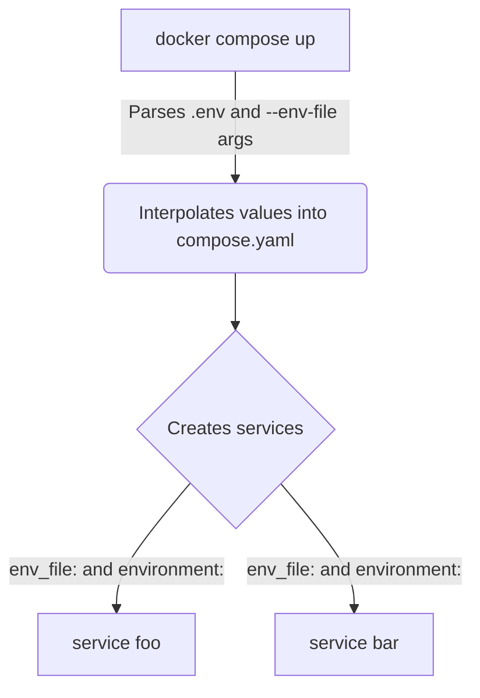
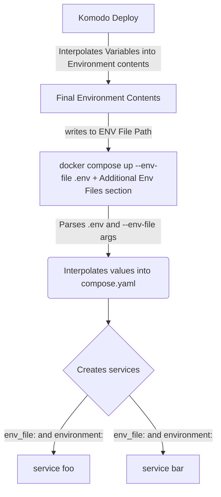

# ENVs and Variable Interpolation in Docker Compose

References:

* [Compose file interpolation](https://docs.docker.com/compose/how-tos/environment-variables/variable-interpolation/#env-file)
* [Environment variables precedence in Docker Compose](https://docs.docker.com/compose/how-tos/environment-variables/envvars-precedence/#how-the-table-works)
* [Set ENV variables within your container's environment](https://docs.docker.com/compose/how-tos/environment-variables/set-environment-variables/#use-the-env_file-attribute)

## Overview

If you learn nothing else from this the key takeaway is that the **`env_file` attribute in a `compose.yaml` file IS NOT related to `.env` and `--env-file`.**

#### Interpolating into `compose.yaml`

The first thing that happens when you do `docker compose up` is that docker parses **host** environmental variables and `.env`/`--env-file` and then uses these to substitute values **only into `compose.yaml`**. **None of the parsed variables are automatically given to the eventual services/containers** They are only used to "fill out" your compose.yaml file.

* When no `--env-file` arg is given to `compose up` then docker uses a `.env` file located next to `compose.yaml`, if one is present.
* If an `--env-file` arg is given then it uses that **instead of `.env`**
* You can provide multiple `--env-file` args to provide multiple files

#### Providing ENVs to Containers/Services

In **each service** in `compose.yaml` you need to explicitly define how ENVs are provided. This is done through

* `environment:` attribute with key-values like `MY_KEY: myVal`
* and/or `env_file:` attribute where you can define a file with key-values that are all loaded into the container

Both of these can be used. **The same files used for `.env`/`--env-file` can be used here but they must be explicitly defined.**

### Compose Flow



## Examples

Build the image first

```
docker compose build
```

Running the container results in a single command being run that prints ENVs available in the container:

```
echo "This is a variable: $FOO $BAR $HARD"
```

### Default Compose File ENVs

```shell
docker compose up
```

* Uses [compose.yaml](/compose.yaml)
* Uses `.env` for Compose file since no other `--env-file` args
* Compose file does not define any env attributes for the service so nothing from `.env` is inserted into container

Output is 

```
This is a variable:
```

### Using `environment:` in Compose File

#### Using default `.env`

```shell
docker compose -f compose-environment.yaml up
```

* Uses [compose-environment.yaml](/compose-environment.yaml)
* Uses `.env` for Compose file since no other `--env-file` args
* Compose file has `environment:` where...
   * `FOO` (container ENV) is set to `${FOO}` from `.env`
   * `HARD` (container ENV) is hardcoded to `alwaysHere` in compose file

   Output is 

```
This is a variable: aSecret alwaysHere
```

#### Using explicit `add.env`

```shell
docker compose -f compose-environment.yaml --env-file add.env up
```

* Uses [compose-environment.yaml](/compose-environment.yaml)
* Uses `add.env` for Compose file because of `--env-file` args
* Compose file has `environment:` where...
   * `BAR` (container ENV) is set to `${BAR}` from `add.env`
   * `HARD` (container ENV) is hardcoded to `alwaysHere` in compose file

   Output is 

```
This is a variable: someBar alwaysHere
```

#### Using multiple explicit `add.env`

```shell
docker compose -f compose-environment.yaml --env-file add.env --env-file .env up
```

* Uses [compose-environment.yaml](/compose-environment.yaml)
* Uses `add.env` for Compose file because of `--env-file` arg
* Uses `.env` for Compose file because of `--env-file` arg
* Compose file has `environment:` where...
   * `FOO` (container ENV) is set to `${FOO}` from `.env`
   * `BAR` (container ENV) is set to `${BAR}` from `add.env`
   * `HARD` (container ENV) is hardcoded to `alwaysHere` in compose file

   Output is 

```
This is a variable: aSecret someBar alwaysHere
```

### Using `env_file:` in Compose File

```shell
docker compose -f compose-envfile.yaml up
```

* Uses [compose-envfile.yaml](/compose-envfile.yaml)
* Uses `.env` for Compose file since no other `--env-file` args
* Compose file has `env_file:` which inserts everything found in the attribute value (`add.env`) into the container

Output is 

```
This is a variable: someBar
```

### Using `.env` or `--env_file` with other things in Compose file

```shell
docker compose -f compose-envfile-interpolated.yaml --env-file inter.env up
```

* Uses [compose-envfile-interpolated.yaml](/compose-envfile-interpolated.yaml)
* Uses `inter.env` for Compose file because of `--env-file` arg
  * Would also work if contents of `inter.env` was instead in `.env` and no `--env-file` was provided...
* `env_file:` attribute has the value `${ENV_FILE_USED}`
  * which is in `inter.env` with the value as `add.env`
  * so compose file uses `env_file: add.env`

Output is 

```
This is a variable:  someBar 
```

Remember that the interpolation of variables from `.env`/`--env-file` can be used _anywhere_ in the compose file. Even in keys.

# Komodo and ENVs

[Komodo](https://komo.do/) adds one more layer to this process that occurs **before `docker compose up`**.

Komodo takes the contents of the **Environment** section of your Stack and:

* Interpolates any [Variables](https://komo.do/docs/variables) into the contents like `[[MY_VAR]]`
* The final content is written to file specified by **Env File Path** in your Stack

After this is done it then runs `docker compose up --env-file .env` and includes any additional files you specified in the **Additional Env Files** section of your stack.

